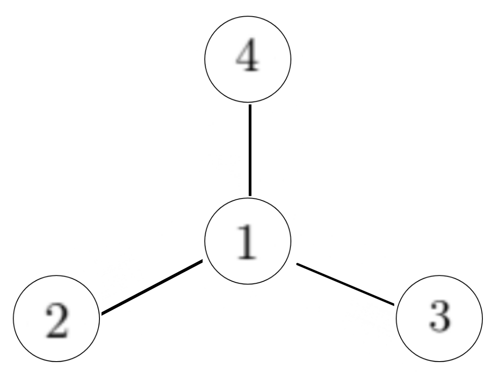

## **Take Home**
Professor MA being a maverick has given your class a take home end-semester examination. There are $k$ questions in the end-semester exam and they are worth different marks. There are $n$ students in the class, with each person having at least $1$ friend and at most $f$ friends.

Prof. MA knows about this, and makes a couple of assumptions. He assumes that if $A$ and $B$ are friends, and $A$ and $C$ are friends, then none of them will do the same question, and $B$ and $C$ are not friends. He also assumes that each student will attempt to solve only one question, because they know everyone is getting an `A` anyway.

Under these assumptions, he wants to know the maximum cumulative score the class can get, but since he is so busy, he asks for your help. Can you help him?

### **Input**
The first line contains three integers, $n$, $f$, and $k$ ($1\leq n\leq 2\cdot10^4$, $1\leq f\leq 4$, $1\leq k\leq 10$), the number of students, maximum number of friends one can have, and the total number of questions, respectively.

The next $n-1$ lines contain two integers $u$ and $v$ ($1\leq u, v\leq n$), meaning that student with these roll numbers are friends.

The last line of the input contains $k$ integers $m_1, m_2,\dots, m_k$ ($1\leq m_i\leq 1000$) where $m_i$ is the marks for the $i^{th}$ question.

### **Output**
Output a single integer, the maximum sum of marks the class can score.

### **Example**

| Input |
---
```
4 3 5
1 2
1 3
1 4
1 2 3 4 5
```
| Output |
---
```
14
```
<br>
<br>

| Input |
---
```
1 3 4
1 4 10 64
```
| Output |
---
```
64
```

### **Explanation**
In sample input #1, the friend group looks like this-



Students $1, 2, 3, 4$ can solve questions worth $5, 4, 3,$ and $2$ respectively, to get a cumulative score of $5+4+3+2=14$ marks